<p align="center">
  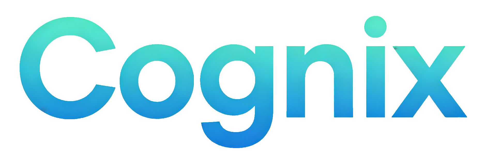
</p>

<h1 align="center">Cognix — 智能题库练习平台</h1>

<p align="center">
  <strong>刷题 · 挑战 · 成长 · 分享</strong>
</p>

<p align="center">
  <a href="https://cognix.liveling.top" target="_blank">🔗 在线体验</a> ·
  <a href="#-功能特性">✨ 功能特性</a> ·
  <a href="#-快速开始">🚀 快速开始</a> ·
  <a href="#-技术栈">🛠 技术栈</a>
</p>

<p align="center">
  
  
  
  
  
  
  
</p>

<br />

> 🚀 **在线体验**：[https://cognix.liveling.top](https://cognix.liveling.top) — 免费注册即刻开始刷题！

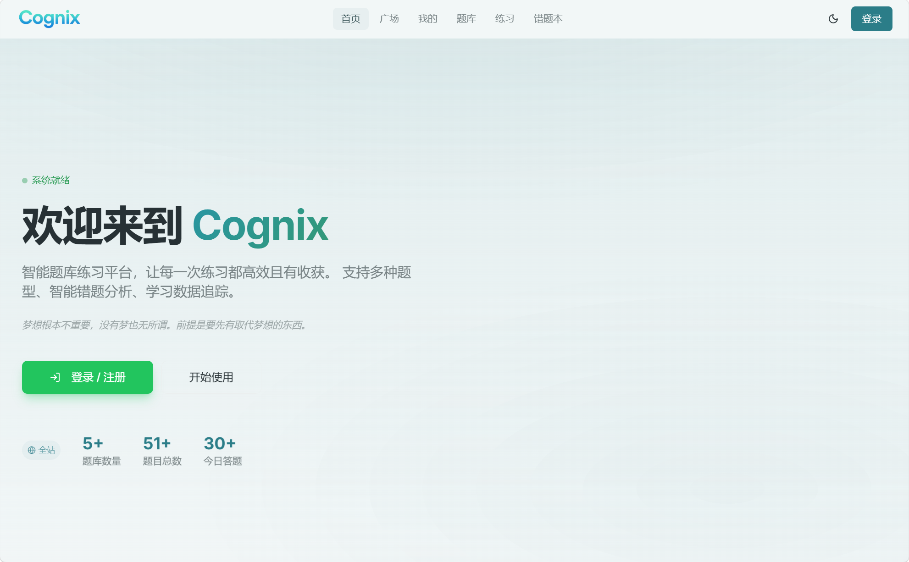

---

## 📖 目录

- [✨ 功能特性](#-功能特性)
  - [📚 题库与题目管理](#-题库与题目管理)
  - [🌐 题库广场](#-题库广场)
  - [🤖 AI 智能导入与生成](#-ai-智能导入与生成)
  - [🎯 多模式练习](#-多模式练习)
  - [⚡ 挑战模式](#-挑战模式)
  - [📊 学习追踪与统计](#-学习追踪与统计)
  - [👤 用户系统](#-用户系统)
  - [🎨 界面与体验](#-界面与体验)
- [🛠 技术栈](#-技术栈)
- [🚀 快速开始](#-快速开始)
- [📁 项目结构](#-项目结构)
- [🗄 数据库设计](#-数据库设计)
- [🤖 AI 服务商配置](#-ai-服务商配置)
- [🚢 部署](#-部署)
- [📸 产品截图](#-产品截图)
- [🤝 贡献指南](#-贡献指南)
- [📄 License](#-license)

---

## ✨ 功能特性

Cognix 是一个现代化的多用户智能题库练习平台。从创建题库到刷题练习，从 AI 出题到社区共享，从学习统计到挑战极限 — 你将得到一站式的刷题体验。

### 📚 题库与题目管理

所有题目归属到「题库」下管理，一个题库可容纳任意数量的题目。

- **创建与管理** — 新建题库时填写标题和简介，支持随时编辑。列表页展示题目数量，一目了然。
- **手动录入** — 逐题编写题干、选项（最多 6 个）、正确答案和解析，设置难度等级（简单 / 中等 / 困难）和自定义标签。
- **批量操作** — 支持全选、批量删除题目，以及一键清空整个题库。
- **搜索与筛选** — 按关键词搜索题目，按题型（单选 / 多选 / 判断 / 填空 / 简答）和难度快速过滤。
- **题库共享** — 可将题库设为公开共享，出现在广场中供其他用户一键导入。

### 🌐 题库广场

题库广场是 Cognix 的社区共享空间。用户可公开分享优质题库，其他人搜索、浏览并一键导入。

- **搜索浏览** — 按题库名称模糊搜索，卡片式布局展示标题、简介、题目数量和作者。
- **一键导入** — 点击按钮即可将共享题库复制到自己的账户，自动去重，已导入的题库标记为「已导入」。
- **溯源追踪** — 导入的题库会记录来源，方便回溯原作者。

### 🤖 AI 智能导入与生成

内置强大的 AI 辅助功能，大幅降低题目录入成本。支持 **OpenAI、DeepSeek、智谱 GLM、Moonshot** 以及任意兼容 OpenAI 协议的自定义服务商。

- **导入已有题目** — 直接粘贴题目文本或上传文件（支持 txt/md/docx/pdf），AI 自动解析题型、提取选项和答案。
- **从材料生成题目** — 上传学习资料，分别指定单选、多选、判断三种题型的生成数量，AI 根据材料内容智能出题。
- **逐题审核** — 生成完成后进入审核步骤，可逐题编辑题干、选项、答案和解析，确认无误后一次性保存入库。
- **连接测试** — 在 Profile 页配置 AI 后，一键测试连接是否正常，通过后才允许使用 AI 功能。

### 🎯 多模式练习

- **顺序练习** — 按题库原始顺序逐题作答，答完全部统一提交，适合第一轮系统学习。
- **随机练习** — 随机抽取题目，打乱顺序，模拟真实考试的不确定性。
- **错题复习** — 针对历史错题强化训练。每道错题连续答对 3 次后自动标记为「已掌握」，从错题本归档。
- **灵活设置** — 每次练习前可选择题库、模式、题目数量，随时调整练习策略。
- **计时统计** — 每道题独立计时 + 整场练习总计时，练习结束展示正确率、总用时和逐题详情。

### ⚡ 挑战模式

> 🆕 **新功能** — 答对前进，答错出局，挑战你的极限！

- **连续闯关** — 从所有题库中随机出题，答对才能进入下一题。
- **三条命机制** — 一共只有 3 次答错机会，用完即挑战结束。
- **最高记录** — 系统记录你的最高连续答对数，在 Profile 页展示。
- **跨题库挑战** — 支持同时选择题库参与挑战，题量上限为所有题库题目总数。

### 📊 学习追踪与统计

一整套学习数据追踪体系，让你的进步看得见。

- **个人仪表盘** — Profile 页集中展示今日答题数、正确率、连续学习天数、题库总数、最高挑战记录。
- **学习热力图** — GitHub 风格的 6 个月学习热力图，每天练习量以颜色深浅呈现。
- **练习记录** — 列出最近练习的日期、模式、正确率和用时。
- **等级系统** — 四档等级称号：🟢 初学者 → 🔵 勤奋学员 → 🟣 进阶学者 → 🏆 刷题大师（基于总答题数）。
- **AI 用量统计** — AI 调用统计卡片，展示今日 / 总计的 Token 消耗和调用次数。
- **全站统计** — 首页可切换查看「全站」或「个人」统计，全站模式展示平台总题库数、总题目数、今日总答题量、注册用户数。

### 👤 用户系统

- **邮箱注册** — 邮箱 + 密码注册，发送 6 位 OTP 验证码到邮箱，验证通过后完成注册。
- **密码登录** — 支持「记住我」（自动填充邮箱和头像）和「记住密码」（加密存储于 Cookie）。
- **忘记密码** — 输入邮箱获取 OTP → 设置新密码，无需管理员介入。
- **第三方登录** — 支持 **Gitee OAuth** 和 **GitHub OAuth** 两种快捷登录方式。
- **个人资料编辑** — 修改昵称、个人简介。头像支持本地上传裁剪或自动获取 QQ 头像。
- **密码修改** — 在 Profile 页通过模态框修改密码。
- **独立 AI 配置** — 每个用户拥有独立的 AI 服务商、API Key 和模型设置，仅自己可见。
- **DeepSeek 余额查询** — 配置 DeepSeek API Key 后自动拉取账户余额，一键刷新。

### 🎨 界面与体验

- **🌓 暗色模式** — 亮色 / 暗色主题一键切换，自动记忆偏好。
- **📱 响应式布局** — 桌面端宽屏 + 移动端自适应，手机刷题体验流畅。
- **✨ 滚动入场动画** — 功能卡片等元素在滚动进入视口时播放精致的入场动画。
- **💬 一言** — 首页和登录页展示随机「一言」语录，调用一言 API 并缓存。
- **🦴 骨架屏加载** — 数据加载时展示骨架屏占位，避免页面跳动。
- **⚡ 懒加载路由** — 所有页面组件基于 React.lazy 按需加载，首屏体积更小。

---

## 🛠 技术栈

| 层级 | 技术 | 说明 |
|:---|:---|:---|
| 前端框架 | React 19 + TypeScript | 函数组件 + Hooks，严格类型约束 |
| 编译优化 | React Compiler（Babel 插件） | 自动 memoization |
| 构建工具 | Vite 8 | 极速 HMR，ESBuild 预构建 |
| 样式方案 | Tailwind CSS 3 | 原子化 CSS，暗色模式开箱即用 |
| 路由 | React Router v7 | 组件式路由，懒加载 Suspense |
| 状态管理 | Zustand 5 | 轻量级全局状态，按需订阅 |
| 图标库 | Lucide React + Font Awesome | 两套图标互补覆盖 |
| 后端服务 | **Supabase** | 数据库 + 认证 + RLS + 实时订阅 |
| 数据库 | PostgreSQL（Supabase 托管） | 关系型存储，函数 + 触发器 |
| 认证 | Supabase Auth | 邮箱 OTP + OAuth 2.0 |
| 边缘函数 | EdgeOne Pages Functions | Gitee OAuth 回调处理 |
| AI 协议 | OpenAI-compatible API | 多服务商统一接口 |
| 托管部署 | 腾讯云 EdgeOne Pages | 全球 CDN 加速 |

---

## 🚀 快速开始

### 前置要求

- **Node.js** ≥ 20
- **Supabase** 项目（[免费创建](https://supabase.com)）
- （可选）**EdgeOne Pages** 项目（用于 Gitee OAuth 和部署）

### 本地开发

```bash
# 克隆仓库
git clone https://github.com/live-ling/cognix.git
# 或 Gitee: git clone https://gitee.com/whpa24soft/cognix.git
cd cognix

# 安装依赖
npm install

# 启动开发服务器
npm run dev
```

访问 `http://localhost:5173`

### 环境变量

在项目根目录创建 `.env` 文件：

```env
# Supabase（必填）
VITE_SUPABASE_URL=https://your-project.supabase.co
VITE_SUPABASE_ANON_KEY=your-anon-key

# Gitee OAuth（可选）
VITE_GITEE_CLIENT_ID=your-gitee-client-id
VITE_GITEE_CLIENT_SECRET=your-gitee-client-secret
```

### 数据库初始化

1. 打开 [Supabase Dashboard](https://supabase.com/dashboard) → SQL Editor
2. 将 [`supabase/schema.sql`](supabase/schema.sql) 的内容粘贴并执行
3. 脚本会自动创建所有表、索引、RLS 策略、存储函数和触发器

---

## 📁 项目结构

```
cognix/
├── src/
│   ├── components/
│   │   ├── layout/           # 页面布局（Header + 内容 + Footer）
│   │   └── ui/               # UI 组件库（Button、Card、Badge、Input、Skeleton 等）
│   ├── contexts/             # React Context（认证、主题）
│   ├── hooks/                # 自定义 Hooks
│   ├── lib/                  # 工具库（Supabase 客户端、类型定义、缓存、Cookie）
│   ├── pages/                # 页面组件（懒加载）
│   │   ├── home.tsx          # 首页
│   │   ├── login.tsx         # 登录 / 注册 / 忘记密码
│   │   ├── profile.tsx       # 个人主页 + 仪表盘
│   │   ├── bank-list.tsx     # 题库列表
│   │   ├── bank-detail.tsx   # 题库详情 + 题目管理
│   │   ├── practice-setup.tsx # 练习设置
│   │   ├── practice-session.tsx # 练习答题 + 挑战模式
│   │   ├── mistakes.tsx      # 错题本
│   │   └── square.tsx        # 题库广场
│   └── App.tsx               # 根组件 + 路由配置
├── edge-functions/           # EdgeOne Pages Functions
├── supabase/schema.sql       # 完整数据库 Schema
├── public/                   # 静态资源
└── docs/images/              # 产品截图
```

---

## 🗄 数据库设计

所有表均启用 **RLS（Row Level Security）**，用户只能访问和操作自己的数据。

| 表 | 说明 | 关键特性 |
|:---|:---|:---|
| `profiles` | 用户资料（1:1 关联 `auth.users`） | 角色系统、AI 配置、唯一昵称 |
| `banks` | 题库 | 共享机制、来源追踪 |
| `questions` | 题目 | 5 种题型、难度分级、标签系统 |
| `practice_sessions` | 练习会话 | 4 种模式、计时统计 |
| `practice_details` | 每题答题详情 | 用户答案、正确性、用时 |
| `mistakes` | 错题记录（去重聚合） | 连续正确追踪、自动归档 |
| `learning_logs` | 每日学习日志 | 热力图数据源 |
| `challenge_records` | 挑战模式记录 | 最高连续答对数 |
| `ai_usage_logs` | AI 调用用量 | Token 统计 |
| `share_requests` | 题库共享审批 | 管理员审核机制 |

核心 RPC 函数：`get_dashboard_stats()` · `get_site_stats()` · `get_ai_usage_stats()` · `copy_shared_bank()`

---

## 🤖 AI 服务商配置

| 服务商 | API 地址 | 推荐模型 |
|:---|:---|:---|
| OpenAI | `https://api.openai.com/v1` | gpt-4o、gpt-4o-mini、gpt-4.1、o4-mini |
| DeepSeek | `https://api.deepseek.com` | deepseek-chat、deepseek-reasoner |
| 智谱 GLM | `https://open.bigmodel.cn/api/paas/v4` | glm-4-plus、glm-4-flash |
| Moonshot | `https://api.moonshot.cn/v1` | moonshot-v1-8k、moonshot-v1-32k |
| 自定义 | 自行填写 | 兼容 OpenAI 协议即可 |

配置流程：选择服务商 → 填入 API Key → 测试连接 → 保存。

---

## 🚢 部署

### EdgeOne Pages（推荐）

项目已在腾讯云 EdgeOne Pages 上运行，享受全球 CDN 加速。

| 配置项 | 值 |
|:---|:---|
| 构建命令 | `npm run build` |
| 输出目录 | `dist` |
| Node 版本 | 20 |
| SPA 回退 | 404 → `/index.html`（状态码 200） |

### 其他平台

构建产物为纯静态文件（`dist/`），可部署到 Vercel、Netlify、Cloudflare Pages、Nginx 等。注意需配置 SPA 回退规则。

---

## 📸 产品截图

<details open>
<summary><strong>点击展开 / 折叠</strong></summary>

| 首页 | 题库管理 | 题库广场 |
|:---:|:---:|:---:|
|  | 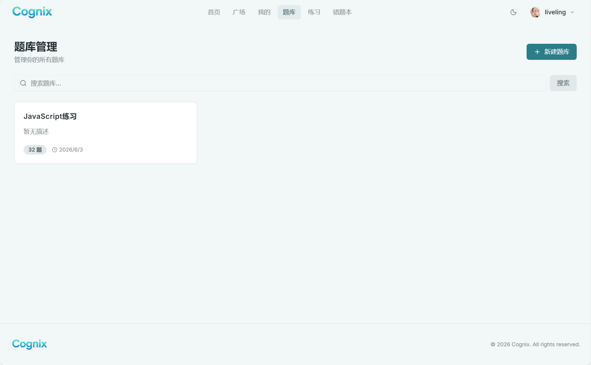 | 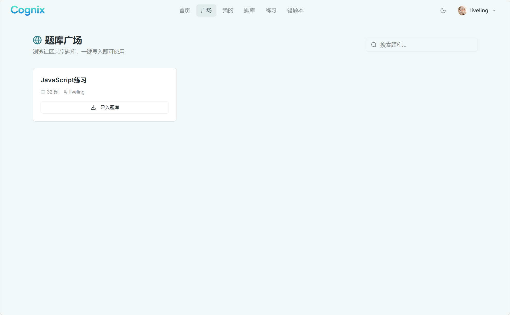 |

| 练习答题 | 练习结果 | 错题本 |
|:---:|:---:|:---:|
| 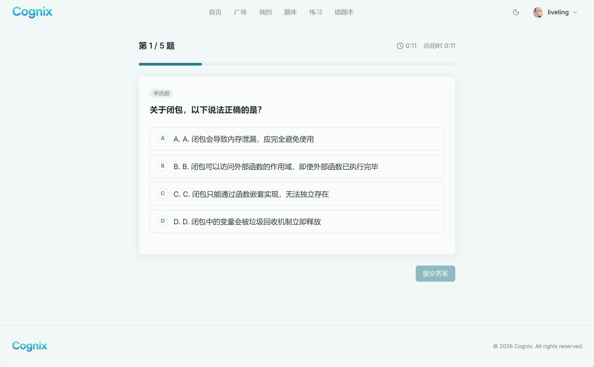 | 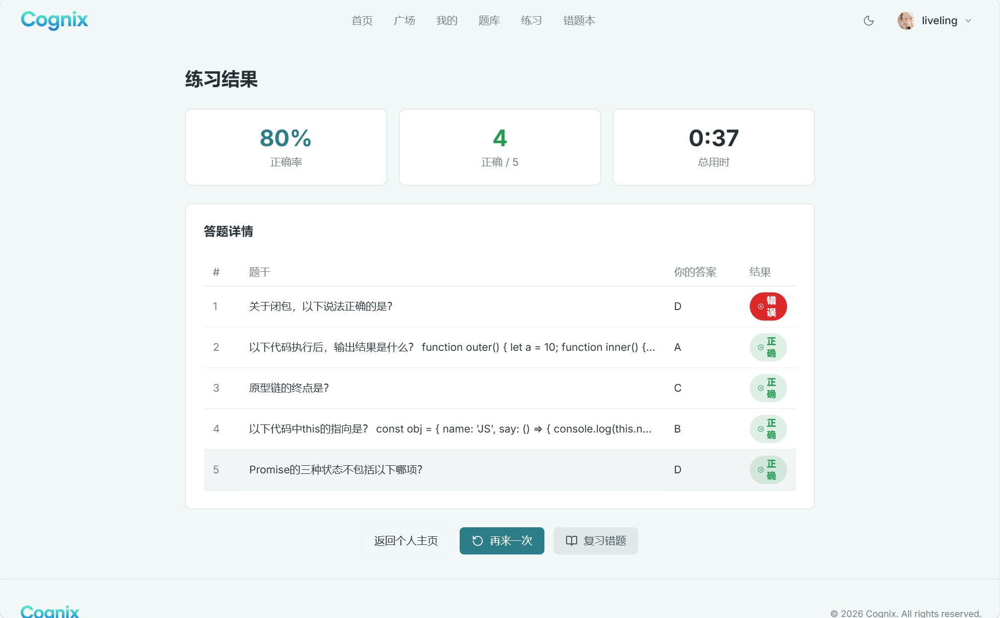 | 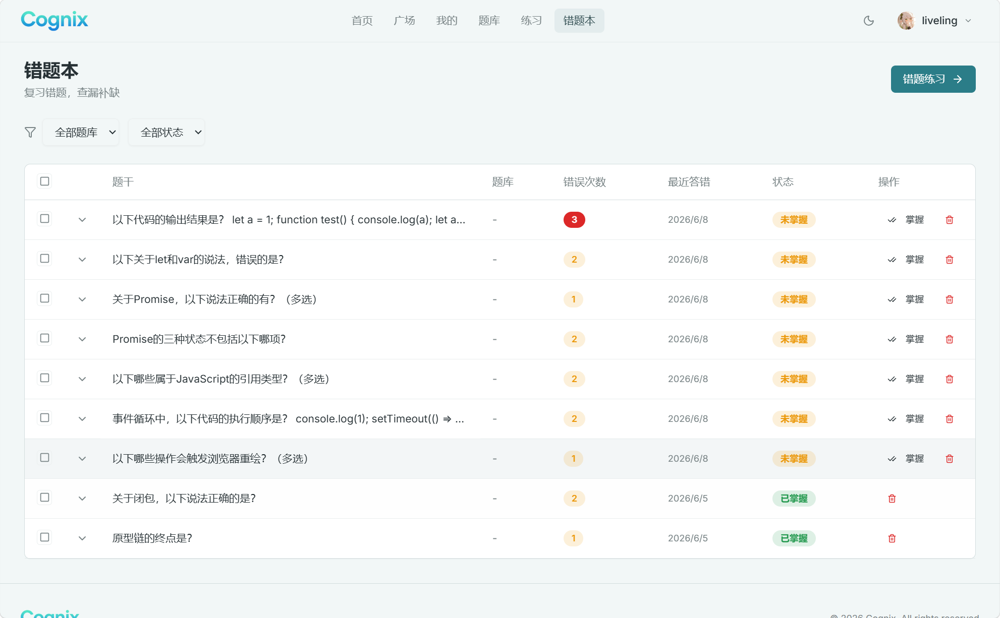 |

| AI 导入 | 学习统计 | 暗色模式 |
|:---:|:---:|:---:|
| 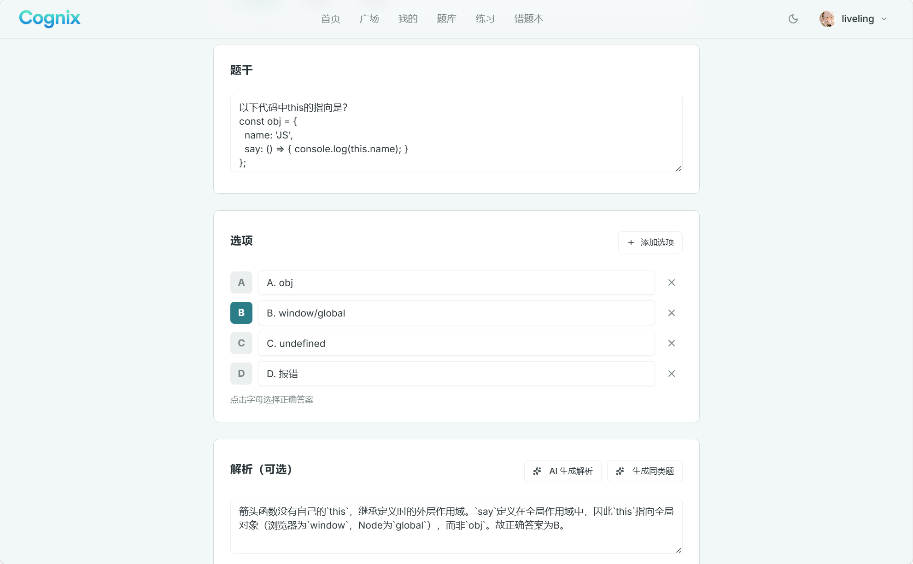 | 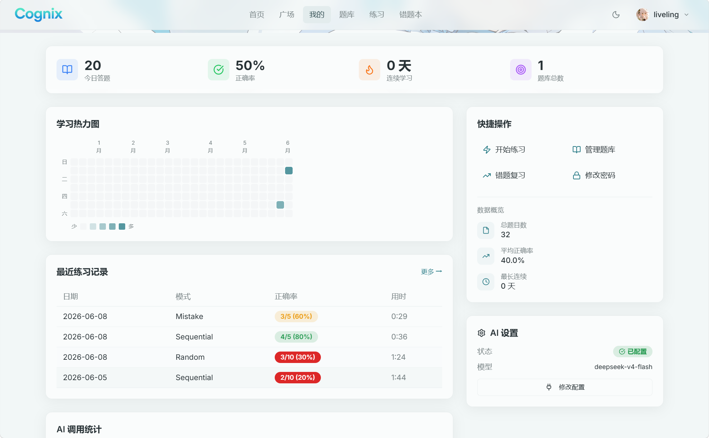 | 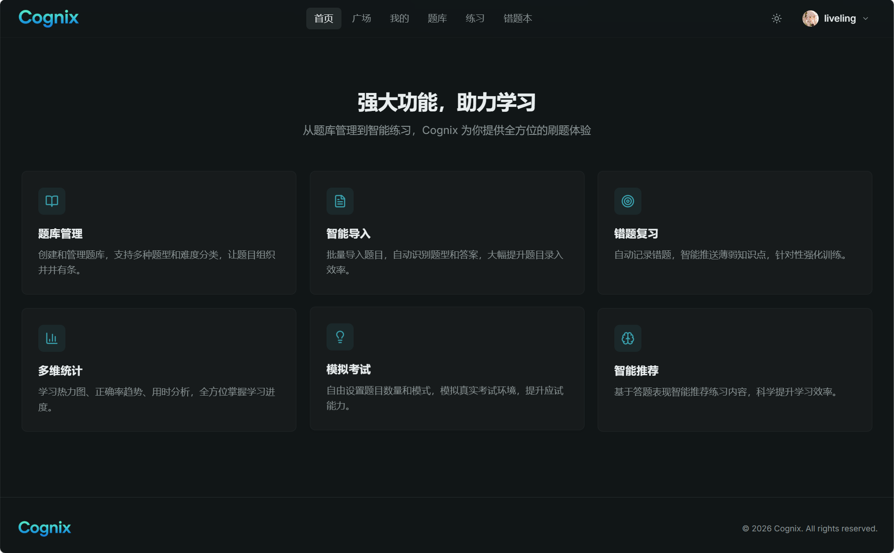 |

| 登录页 | AI 配置 |
|:---:|:---:|
| 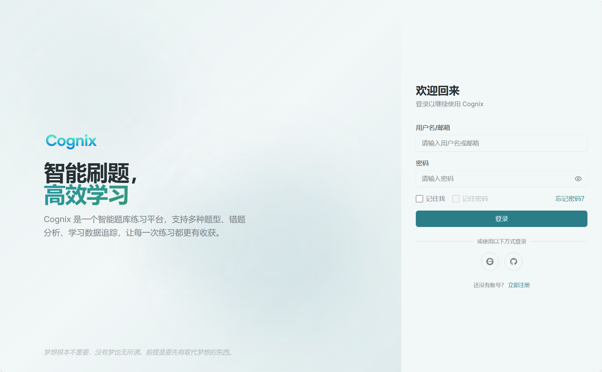 | 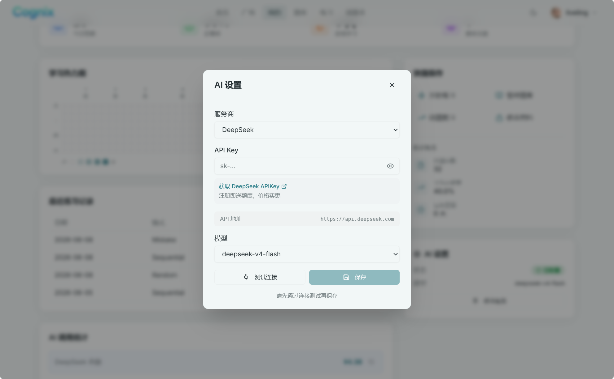 |

</details>

---

## 🤝 贡献指南

欢迎提交 Issue 和 Pull Request！

1. Fork 本仓库
2. 创建特性分支 (`git checkout -b feat/amazing-feature`)
3. 提交改动 (`git commit -m 'feat: add amazing feature'`)
4. 推送到分支 (`git push origin feat/amazing-feature`)
5. 提交 Pull Request

贡献前请确保代码通过 `npm run build` 构建测试。

---

## 📄 License

MIT © [Cognix](https://cognix.liveling.top)

---

<p align="center">
  <sub>Built with ❤️ using React · Supabase · Tailwind CSS</sub>
</p>
